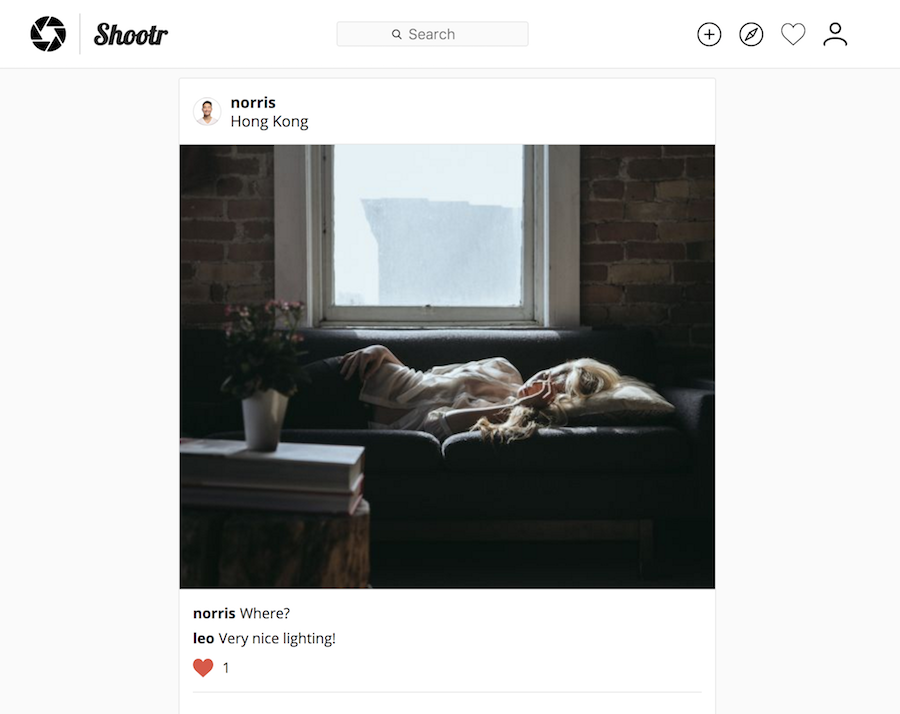
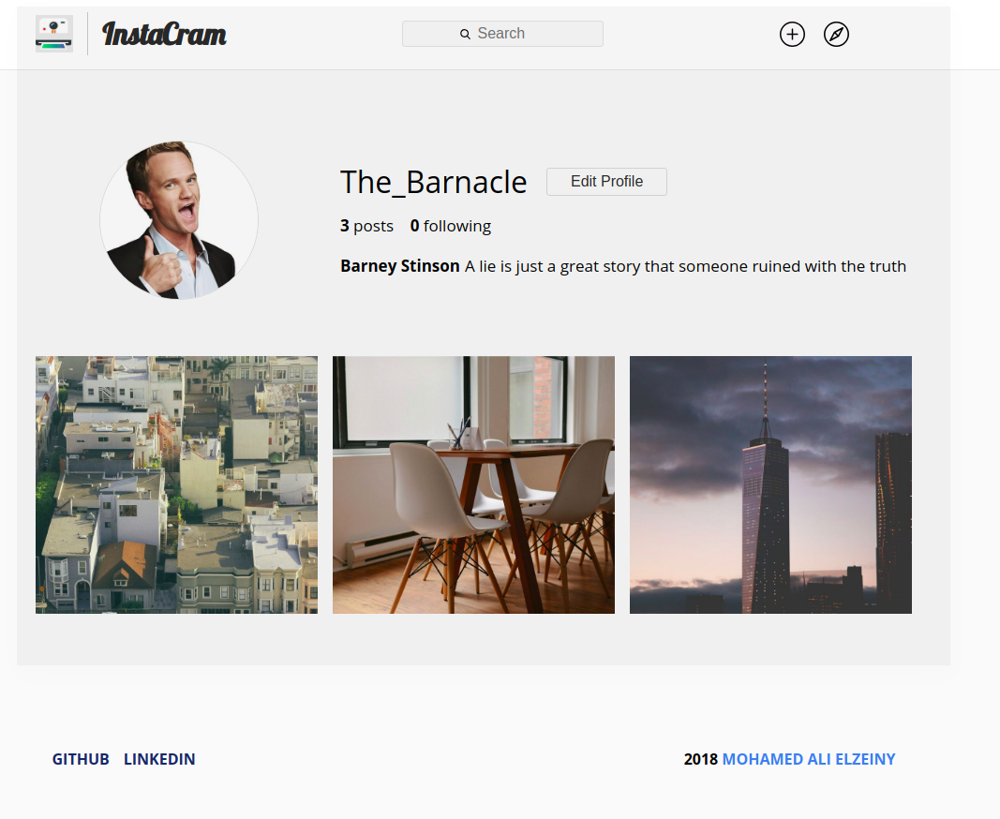
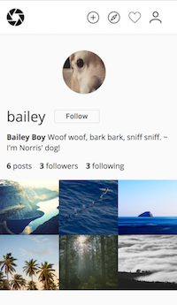
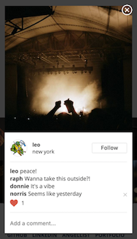

# Shootr

[Shootr][heroku]

[heroku]: https://shootrapp.herokuapp.com

Shootr is a responsive SPA built with a Ruby on Rails backend and React/Redux frontend. Inspired by Instagram, it serves as a platform to allow photographers, professional and amateur, to create a profile, share, and interact with fellow 'Shootrs'. This MVP was styled and developed in 12 days so there's still more to come, desired features are listed at the bottom.

## Features
### User Authentication

Users sign up and log in to upload and edit personal information. While profiles are public, protected routes limit navigation and features accessibility. An animated guest login was added for fun!

### Photos/Feed/Filters

Photos uploaded by users and whom they follow are displayed on the main feed. The feed is sorted by created_at, with the most recent upload displaying first. To upload images, simply navigate to the upload page. Click and drag an image to the input field to see a preview. Then, users can toggle buttons to imitate filters. Plans to implement persistence to come. Images are hosted on an Amazon Web Services (AWS) S3 bucket.



### User Profiles

User profiles are public yet limited to functionality. Once logged in, profile editing and CRUD options are available. Clicking an image will open a modal which displays the photo, caption & location, and comments and likes. The layout utilizes CSS3 for responsiveness.



### Likes and Comments

Photos on the main feed and modal views have actions allowing the current user to like/dislike content and add/remove their own comments.


### Mobile Responsive

Media queries and SVGs were used to create a smooth transition between desktop and mobile devices.

  

## Technologies used
### Backend
[Ruby on Rails](http://rubyonrails.org/) was used to serve the backend. [PostgreSQL](https://postgresql.org/) database to store data.
`ActiveRecords` used for Object-relational Mapping.

```
belongs_to :poster,
  primary_key: :id,
  foreign_key: :user_id,
  class_name: :User

has_many :comments,
  primary_key: :id,
  foreign_key: :post_id,
  class_name: :Comment

has_many :likes, as: :likable

has_many :likers,
  through: :likes,
  source: :liker
```

- Hosted on Heroku
- AWS S3 Buckets and Paperclip to host and upload content
- RESTful API endpoints created with Jbuilder
- Figaro for API key protection
- BCrypt for password hashing and privacy

### Frontend
Facebook's [React](https://facebook.github.io/react/) frontend framework was used for speedy rendering. [Redux](http://redux.js.org) architecture was used for unidirectional data flow.

- Webpack for bundling
- Guard for live reloading
- ES6 Javascript

```
componentWillMount() {
  const { requestCommentsForPost, post } = this.props;
  requestCommentsForPost(post)
  .then( () => this.setState({ loading: false }));
}

componentWillReceiveProps(nextProps) {
  if (this.props.commentsByPost !== nextProps.commentsByPost) {
    this.setState({ commentsByPost: nextProps.commentsByPost });
  }
  if (this.props.likesCount !== nextProps.likesCount) {
    this.setState({ liked: nextProps.liked });
    }
  }
}
```
- SCSS and CSS styling based on [SMACSS](https://smacss.com/) style guide

```
$bgcolor: #fafafa;
$var: 15px;

body {
  background: $bgcolor;
  font-family: 'Open Sans', sans-serif;
}

.container {
  padding: $var;
}
```

## Future Features

- Persist photo filters
- Video integration
- AJAX searches
- Explore pages with geolocation
- Infinite scroll
- Hashtags
- Pagination and loading
- Direct messaging
- Live Streaming
